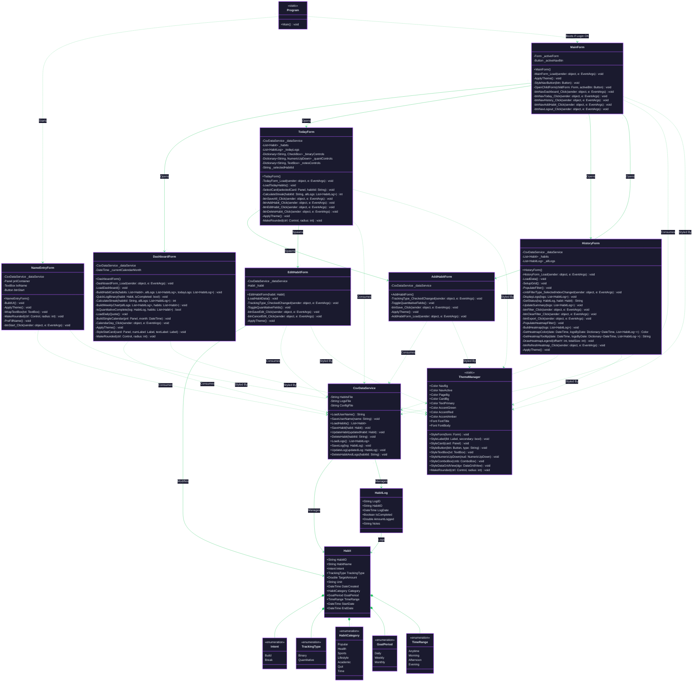

# AOOP_HABI

# Habit Tracker — Class Diagram

```mermaid
%%{init: {
  "theme": "base",
  "themeVariables": {
    "primaryColor": "#1a1a2e",
    "primaryTextColor": "#e2e8f0",
    "primaryBorderColor": "#a855f7",
    "lineColor": "#22c55e",
    "secondaryColor": "#16213e",
    "tertiaryColor": "#0f3460",
    "background": "#0d1117",
    "mainBkg": "#1a1a2e",
    "nodeBorder": "#a855f7",
    "clusterBkg": "#16213e",
    "titleColor": "#a855f7",
    "edgeLabelBackground": "#16213e",
    "classText": "#e2e8f0",
    "fillType0": "#1e1b4b",
    "fillType1": "#14532d",
    "fillType2": "#2e1065",
    "fillType3": "#052e16",
    "fillType4": "#3b0764",
    "fillType5": "#0f3460",
    "fillType6": "#1a1a2e",
    "fillType7": "#16213e"
  }
}}%%

classDiagram

    %% ==========================================
    %% ENUMERATIONS
    %% ==========================================
    class Intent {
        <<enumeration>>
        Build
        Break
    }
    class TrackingType {
        <<enumeration>>
        Binary
        Quantitative
    }
    class HabitCategory {
        <<enumeration>>
        Popular
        Health
        Sports
        Lifestyle
        Academic
        Quit
        Time
    }
    class GoalPeriod {
        <<enumeration>>
        Daily
        Weekly
        Monthly
    }
    class TimeRange {
        <<enumeration>>
        Anytime
        Morning
        Afternoon
        Evening
    }

    %% ==========================================
    %% MODELS
    %% ==========================================
    class Habit {
        +String HabitID
        +String HabitName
        +Intent Intent
        +TrackingType TrackingType
        +Double TargetAmount
        +String Unit
        +DateTime DateCreated
        +HabitCategory Category
        +GoalPeriod GoalPeriod
        +TimeRange TimeRange
        +DateTime StartDate
        +DateTime EndDate
    }

    class HabitLog {
        +String LogID
        +String HabitID
        +DateTime LogDate
        +Boolean IsCompleted
        +Double AmountLogged
        +String Notes
    }

    %% ==========================================
    %% SERVICES
    %% ==========================================
    class CsvDataService {
        -String HabitsFile
        -String LogsFile
        -String ConfigFile
        +LoadUserName() String
        +SaveUserName(name: String) void
        +LoadHabits() List~Habit~
        +SaveHabit(habit: Habit) void
        +UpdateHabit(updatedHabit: Habit) void
        +DeleteHabit(habitId: String) void
        +LoadLogs() List~HabitLog~
        +SaveLog(log: HabitLog) void
        +UpdateLog(updatedLog: HabitLog) void
        +DeleteHabitAndLogs(habitId: String) void
    }

    class ThemeManager {
        <<static>>
        +Color NavBg
        +Color NavActive
        +Color PageBg
        +Color CardBg
        +Color TextPrimary
        +Color AccentGreen
        +Color AccentRed
        +Color AccentAmber
        +Font FontTitle
        +Font FontBody
        +StyleForm(form: Form) void
        +StyleLabel(lbl: Label, secondary: bool) void
        +StyleCard(card: Panel) void
        +StyleButton(btn: Button, type: String) void
        +StyleTextBox(txt: TextBox) void
        +StyleNumericUpDown(nud: NumericUpDown) void
        +StyleComboBox(cmb: ComboBox) void
        +StyleDataGridView(dgv: DataGridView) void
        +MakeRounded(ctrl: Control, radius: int) void
    }

    %% ==========================================
    %% FORMS / UI CLASSES
    %% ==========================================
    class Program {
        <<static>>
        +Main() void
    }

    class NameEntryForm {
        -CsvDataService _dataService
        -Panel pnlContainer
        -TextBox txtName
        -Button btnStart
        +NameEntryForm()
        -BuildUI() void
        -ApplyTheme() void
        -WrapTextBox(txt: TextBox) void
        -MakeRounded(ctrl: Control, radius: int) void
        -PreFillName() void
        -btnStart_Click(sender: object, e: EventArgs) void
    }

    class MainForm {
        -Form _activeForm
        -Button _activeNavBtn
        +MainForm()
        -MainForm_Load(sender: object, e: EventArgs) void
        -ApplyTheme() void
        -StyleNavButton(btn: Button) void
        -OpenChildForm(childForm: Form, activeBtn: Button) void
        -btnNavDashboard_Click(sender: object, e: EventArgs) void
        -btnNavToday_Click(sender: object, e: EventArgs) void
        -btnNavHistory_Click(sender: object, e: EventArgs) void
        -btnNavAddHabit_Click(sender: object, e: EventArgs) void
        -btnNavLogout_Click(sender: object, e: EventArgs) void
    }

    class DashboardForm {
        -CsvDataService _dataService
        -DateTime _currentCalendarMonth
        +DashboardForm()
        -DashboardForm_Load(sender: object, e: EventArgs) void
        -LoadDashboard() void
        -BuildHabitCards(habits: List~Habit~, allLogs: List~HabitLog~, todayLogs: List~HabitLog~) void
        -QuickLogBinary(habit: Habit, isCompleted: bool) void
        -CalculateStreak(habitId: String, allLogs: List~HabitLog~) int
        -BuildWeeklyChart(allLogs: List~HabitLog~, habits: List~Habit~) void
        -IsQuantitativeComplete(log: HabitLog, habits: List~Habit~) bool
        -LoadDailyQuote() void
        -BuildSingleCalendar(pnl: Panel, month: DateTime) void
        -CalendarDay_Click(sender: object, e: EventArgs) void
        -ApplyTheme() void
        -StyleStatCard(card: Panel, numLabel: Label, textLabel: Label) void
        -MakeRounded(ctrl: Control, radius: int) void
    }

    class TodayForm {
        -CsvDataService _dataService
        -List~Habit~ _habits
        -List~HabitLog~ _todayLogs
        -Dictionary~String, CheckBox~ _binaryControls
        -Dictionary~String, NumericUpDown~ _quantControls
        -Dictionary~String, TextBox~ _notesControls
        -String _selectedHabitId
        +TodayForm()
        -TodayForm_Load(sender: object, e: EventArgs) void
        -LoadTodayHabits() void
        -SelectCard(selectedCard: Panel, habitId: String) void
        -CalculateStreak(habitId: String, allLogs: List~HabitLog~) int
        -btnSaveAll_Click(sender: object, e: EventArgs) void
        -btnAddHabit_Click(sender: object, e: EventArgs) void
        -btnEditHabit_Click(sender: object, e: EventArgs) void
        -btnDeleteHabit_Click(sender: object, e: EventArgs) void
        -ApplyTheme() void
        -MakeRounded(ctrl: Control, radius: int) void
    }

    class HistoryForm {
        -CsvDataService _dataService
        -List~Habit~ _habits
        -List~HabitLog~ _allLogs
        +HistoryForm()
        -HistoryForm_Load(sender: object, e: EventArgs) void
        -LoadData() void
        -SetupGrid() void
        -PopulateFilter() void
        -cmbFilterType_SelectedIndexChanged(sender: object, e: EventArgs) void
        -DisplayLogs(logs: List~HabitLog~) void
        -GetStatus(log: HabitLog, habit: Habit) String
        -UpdateSummary(logs: List~HabitLog~) void
        -btnFilter_Click(sender: object, e: EventArgs) void
        -btnClearFilter_Click(sender: object, e: EventArgs) void
        -btnExport_Click(sender: object, e: EventArgs) void
        -PopulateHeatmapFilter() void
        -BuildHeatmap(logs: List~HabitLog~) void
        -GetHeatmapColor(date: DateTime, logsByDate: Dictionary~DateTime, List~HabitLog~~) Color
        -GetHeatmapTooltip(date: DateTime, logsByDate: Dictionary~DateTime, List~HabitLog~~) String
        -DrawHeatmapLegend(offsetY: int, totalSize: int) void
        -btnRefreshHeatmap_Click(sender: object, e: EventArgs) void
        -ApplyTheme() void
    }

    class AddHabitForm {
        -CsvDataService _dataService
        +AddHabitForm()
        -TrackingType_CheckedChanged(sender: object, e: EventArgs) void
        -ToggleQuantitativeFields() void
        -btnSave_Click(sender: object, e: EventArgs) void
        -ApplyTheme() void
        -AddHabitForm_Load(sender: object, e: EventArgs) void
    }

    class EditHabitForm {
        -CsvDataService _dataService
        -Habit _habit
        +EditHabitForm(habit: Habit)
        -LoadHabitData() void
        -TrackingType_CheckedChanged(sender: object, e: EventArgs) void
        -ToggleQuantitativeFields() void
        -btnSaveEdit_Click(sender: object, e: EventArgs) void
        -btnCancelEdit_Click(sender: object, e: EventArgs) void
        -ApplyTheme() void
    }

    %% ==========================================
    %% RELATIONSHIPS & MULTIPLICITY
    %% ==========================================

    %% Object Compositions (Habit owns its Enums)
    Habit "1" *-- "1" Intent
    Habit "1" *-- "1" TrackingType
    Habit "1" *-- "1" HabitCategory
    Habit "1" *-- "1" GoalPeriod
    Habit "1" *-- "1" TimeRange

    %% Associations (HabitLog relates to Habit via HabitID)
    HabitLog "0..*" --> "1" Habit : Logs

    %% Service Dependencies (Data Service manages lists of models)
    CsvDataService "1" --> "0..*" Habit : Manages
    CsvDataService "1" --> "0..*" HabitLog : Manages

    %% Form Navigations (MainForm controls the child forms)
    MainForm "1" --> "1" DashboardForm : Opens
    MainForm "1" --> "1" TodayForm : Opens
    MainForm "1" --> "1" HistoryForm : Opens
    MainForm "1" --> "1" AddHabitForm : Opens

    %% Sub-Form Navigations
    TodayForm "1" --> "1" AddHabitForm : Spawns
    TodayForm "1" --> "1" EditHabitForm : Spawns
    EditHabitForm "1" --> "1" Habit : Modifies

    %% Data Service Consumption (All forms use the service)
    DashboardForm "1" ..> "1" CsvDataService : Consumes
    TodayForm "1" ..> "1" CsvDataService : Consumes
    HistoryForm "1" ..> "1" CsvDataService : Consumes
    AddHabitForm "1" ..> "1" CsvDataService : Consumes
    EditHabitForm "1" ..> "1" CsvDataService : Consumes
    NameEntryForm "1" ..> "1" CsvDataService : Consumes
    MainForm "1" ..> "1" CsvDataService : Consumes

    %% Application Flow
    Program "1" ..> "1" NameEntryForm : Starts
    Program "1" ..> "1" MainForm : Boots if Login OK

    %% Theme Dependencies
    MainForm ..> ThemeManager : Styled By
    DashboardForm ..> ThemeManager : Styled By
    TodayForm ..> ThemeManager : Styled By
    HistoryForm ..> ThemeManager : Styled By
    AddHabitForm ..> ThemeManager : Styled By
    EditHabitForm ..> ThemeManager : Styled By
    NameEntryForm ..> ThemeManager : Styled By
```
