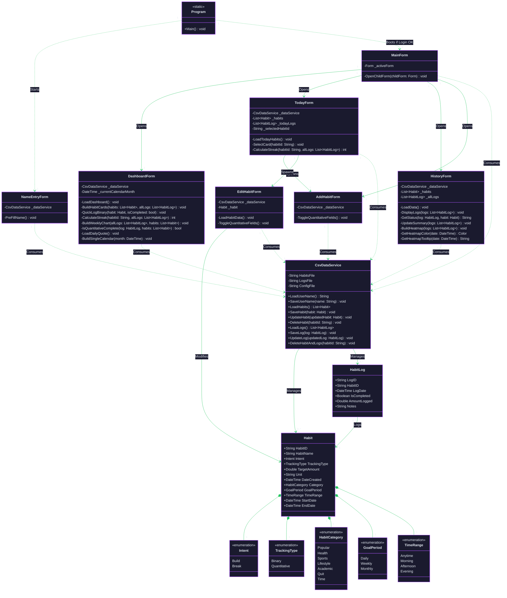

<p align="center">
  <br>
</p>

# I. Description / Overview
H.A.B.I. is a desktop habit-tracking application built in C# Windows Form that allows users to track daily habits/ routines. It is designed for self-improvement-oriented individuals like students who want structure, accountability, and clarity in building their daily routines. The application is single-user and local (C# Windows Forms), making it private, fast, and distraction-free based on the Atomic Habits principle that environment design is the foundation of behavior change.

The application addresses three following problems. Firstly,  people forget their habits because there is no environmental cue reminding them. H.A.B.I. solves this with a daily dashboard that shows the weekly checklist of all habits the moment the app opens that functions as a visual cue that makes good behavior obvious and impossible to ignore. Second, habits feel like chores when there is no reward tied to them so the app proposed streak counters and a progress bar that will make the act of showing up feels worth returning to. And lastly to make it more satisfying,  It delivers instant satisfaction through streaks, completion sounds and a daily/weekly progress bar that makes the invisible work of habit-building feel tangible and rewarding in real time.

# II. HABI — UML Class Diagram


# III. HABI - Features
<table>
  <tr>
    <th>FEATURES</th>
    <th>DESCRIPTION</th>
    <th>STATUS</th>
  </tr>
  <tr>
    <td>CRUD FEATURE - Add Habit Form</td>
    <td>This feature allows users to add habits and they can specify habit name, intent, tracking method (binary/quantitative), category, frequency, reminder time and scheduling (start and end date).
</td>
    <td></td>
  </tr>
  <tr>
    <td>CRUD FEATURE - Edit Habit Form</td>
    <td>Edit feature is revealed when the user navigates into the Today Nav. Button. They can either right click the habit card or select a specific habit and click the edit button to edit a habit's details.
</td>
    <td></td>
  </tr>
   <tr>
    <td>CRUD FEATURE - Delete Habit</td>
    <td>This CRUD feature allows users to delete a specific habit either by right-clicking or selecting a habit and clicking the delete button for a confirmation.
</td>
    <td></td>
  </tr>
   <tr>
    <td>Habit Cards - Panels</td>
    <td>Displays all created habits on organized cards or panel format, showing habit details, schedule, streak counts progress bar (if quantitative) and completion status.
</td>
    <td></td>
  </tr>
   <tr>
    <td>A 4-Month Calendar View</td>
    <td>This feature completes our habit tracker since it displays a 4- month tracker of progress wherein a user can scan if he/she consistently performs their planned habits.
</td>
    <td></td>
  </tr>
   <tr>
    <td>CRUD FEATURE - Search Filtering
</td>
    <td>Enable users to quickly search and filter habits based on keywords, categories, or completion status.</td>
    <td></td>
  </tr>
   <tr>
    <td>HeatMap</td>
    <td>Visualizes user activity and habit completion patterns using color-coded progress tracking over time.
</td>
    <td></td>
  </tr>
   <tr>
    <td>Check List</td>
    <td>Provides a daily checklist where users can mark habits as completed. This serves as a visual cue and tracks progress.
</td>
    <td></td>
  </tr>
   <tr>
    <td>Streak Counter</td>
    <td>Tracks consecutive days/ weeks a habit is completed, motivating users to maintain consistency and not break the streak.
</td>
    <td></td>
  </tr>
   <tr>
    <td>Progress Bar</td>
    <td>Shows daily and weekly completion percentage based on the number of habits finished.</td>
    <td></td>
  </tr>
   <tr>
    <td>Export to csv
</td>
    <td>Enable users to export habit-tracking data into CSV format for reporting and backup purposes.
</td>
    <td></td>
  </tr>
  <tr>
    <td>History View</td>
    <td>Provides access to past habit records and statistics, helping users review long-term progress and performance trends.
</td>
    <td></td>
  </tr>
</table>

---

# ▶️ IV. How to Run the Program

## Prerequisites
Before you begin, ensure your system meets the following requirements:
- Operating System: Windows 10 or Windows 11 (Windows Forms applications run natively on Windows).
- Development Environment: Visual Studio 2022 (The free "Community" edition works perfectly).
- Framework: Ensure the .NET desktop development workload is checked during your Visual Studio installation.

## Step-by-Step Instructions

### **Step 1️⃣: Get the code**
```bash
Step 1: Get the Code
You need to download the source code to your local machine. You can do this in two ways:
Option A: Using Git (Recommended)
Open your Command Prompt or Terminal.
Navigate to the folder where you want to save the project.
Run the following command to clone the repository:

Bash
git clone https://github.com/darumous1301/AOOP_HABI.git

Option B: Direct Download (No Git required)
Go to the project's GitHub page.
Click the green <> Code button at the top right of the file list.
Select Download ZIP.
Extract the downloaded ZIP file to a folder on your computer.

```

### **Step 2️⃣: Open the project**
```bash
Open Visual Studio 2022.
Click on Open a project or solution.
Navigate to the folder where you cloned or extracted the project.
Look for the Solution file named AOOP_HABI.slnx and double-click it to open the project.
```

### **Step 3️⃣: Build the application**
```bash
Before running the app, Visual Studio needs to compile the code.
At the very top of Visual Studio, click on Build in the menu bar.
Click Build Solution (Alternatively, press Ctrl + Shift + B on your keyboard).
Look at the "Output" window at the bottom of the screen. You should see a message indicating the build succeeded with 0 errors.
```

### **Step 4️⃣: Run the application**
```bash
You have two ways to run the application:
Method 1: Running through Visual Studio (Recommended for Testing)
Look for the green play button ▶️ labeled Start at the top center of Visual Studio.
Click it (or press F5).
The application will launch immediately!
Method 2: Running the Executable (.exe) Directly If you just want to run the app without opening Visual Studio every time:
Open your File Explorer.
Navigate into the project folder, then go to: AOOP_HABI \ bin \ Debug \ netX.X-windows (or just bin \ Debug depending on your specific target framework).
Double-click the AOOP_HABI.exe file to launch the program directly.
What to Expect on Your First Run
The Welcome Screen: Because this is your first time opening the app, you will immediately be greeted by the Welcome Screen. It will ask for your name to personalize your dashboard.
Local Data Creation: The application uses a completely local, offline database. When you save your name and log your first habits, the application will automatically generate lightweight data files (like config.txt, habits.csv, and habitlogs.csv) in your application folder to save your progress permanently.
```

# 👨‍💻 V. Author & Acknowledgements

##  ‧₊˚ ┊ Contributors

<table>
<tr>
    <th> &nbsp; </th>
    <th> Name </th>
    <th> Role </th>
</tr>
<tr>
    <td> </td>
    <td><strong>Alyzza Monique Q. Aragon, BSCS</strong> <br/>
    <a href="https://github.com/darumous1301" target="_blank">
    
        </a>
    </td>
    <td>Front-End Developer</td>
</tr>
<tr>
    <td> </td>
    <td><strong>Anica Kim D. Baruel, BSCS</strong> <br/>
    <a href="https://github.com/ciancrey" target="_blank">
     
        </a>
    </td>
    <td>Project Manager & Documentation Head</td>
</tr>
<tr>
    <td> </td>
    <td><strong>Ivy Emerald C. Julongbayan, BSCS</strong> <br/>
    <a href="https://github.com/Anicakim13" target="_blank">
    
        </a>
    </td>
    <td>Back-End Developer</td>
</tr>
</table>
---

## 🙏 VI. Acknowledgements

We would like to express our gratitude to:

- **Ms. Fatima Marie M. Agdon** - for guiding us throughout the development of the project, for the consultation sessions, and for the tips to make our project appealing. Your expertise and inputs from our previous proposal drives us to have a clear goal in pursuing this project. We are truly grateful.
- **CS-2201** -  for sharing ideas and giving feedback to make our proposed Habit Tracker meaningful.
- **Visual Studio | GitHub | AI Tools | Online Community** - for being our tool to successfully implement the game and for giving us assistance for us to be guided in the process of doing it.
---
